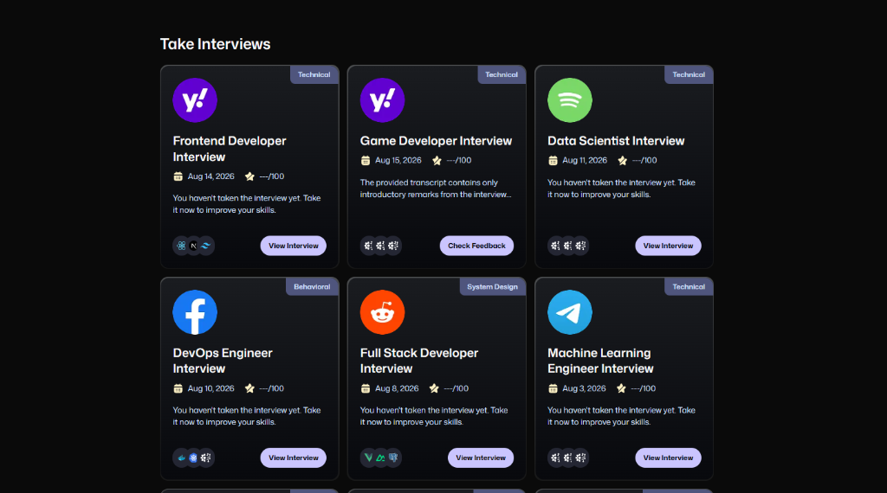
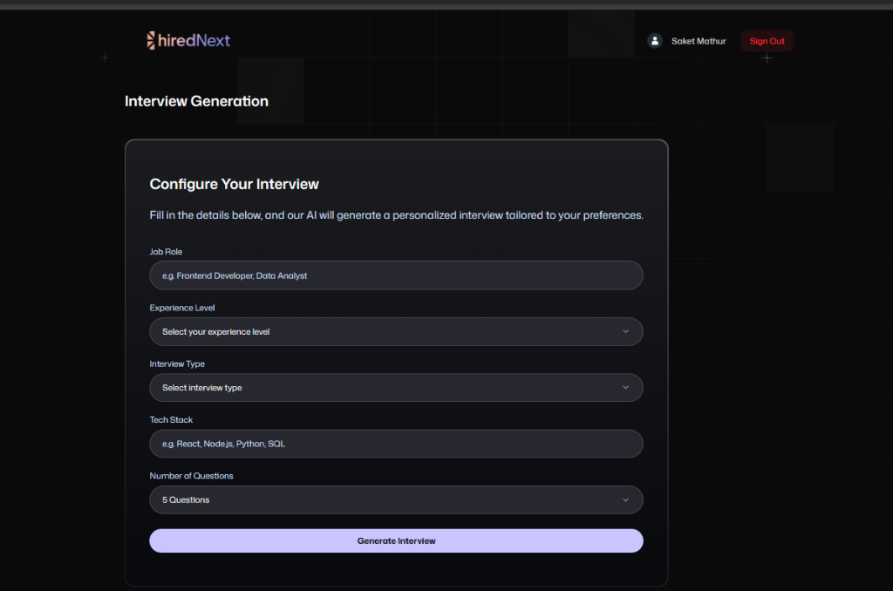
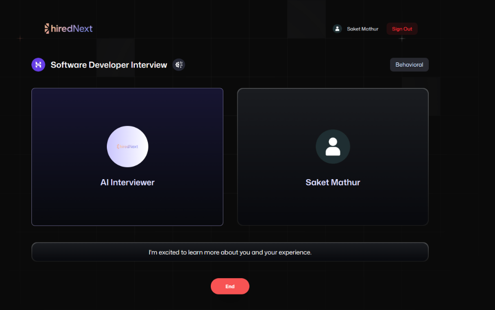
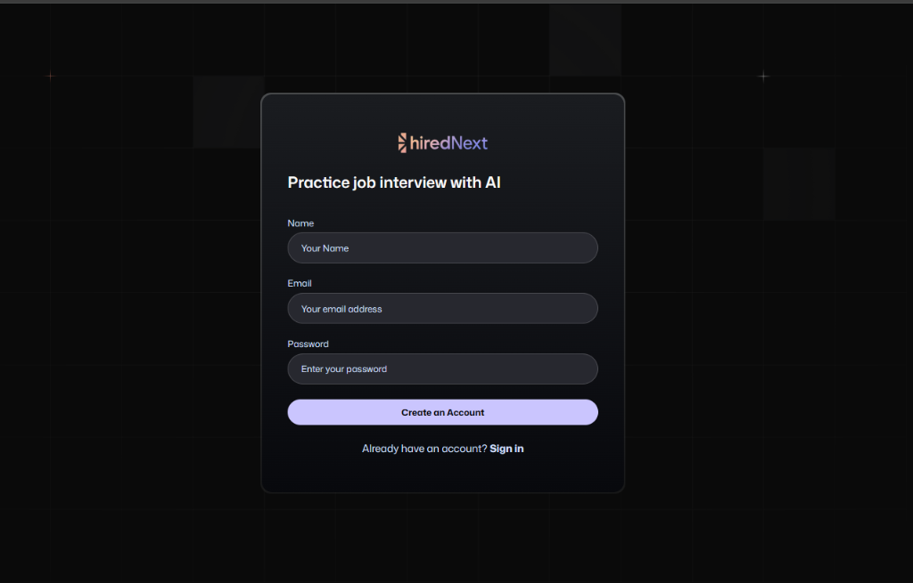
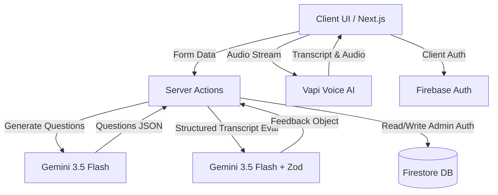

<div align="center">
  

  <h1>🚀 hiredNext: AI-Powered Real-Time Mock Interview Platform</h1>
  
  <p><strong>An AI-driven mock interview platform that simulates realistic technical interviews through real-time voice interaction, personalized questioning, and automated performance analysis.</strong></p>

  <p>
    
    
    
    
    
    
  </p>
</div>

<hr />

## 🌟 Overview

**hiredNext** is a production-grade mock interview application designed to solve a critical problem in the tech industry: the inability for candidates to practice conversational, real-world interviews without a human partner. 

By leveraging advanced **Voice AI (Vapi)** and **Google's Gemini LLMs**, hiredNext allows candidates to undergo realistic, conversational technical interviews, providing detailed, structured feedback on their communication, problem-solving, and technical knowledge. 

This project goes far beyond a standard CRUD application; it demonstrates the integration of complex AI workflows, real-time voice synthesis, edge-compatible server actions, and a robust Firebase backend architecture.

---

## 📸 Project Preview

<table style="width: 100%;">
  <tr>
    <td style="width: 50%; text-align: center;">
      <h3>📊 Dashboard & Analytics</h3>
      <p><i>The central hub where users track progress and analyze past interviews.</i></p>
      
    </td>
    <td style="width: 50%; text-align: center;">
      <h3>🔍 Role Selection</h3>
      <p><i>Explore interviews tailored to specific domains, dynamically loaded with premium banners.</i></p>
      
    </td>
  </tr>
  <tr>
    <td style="width: 50%; text-align: center;">
      <h3>🗣️ Real-Time Voice Interview</h3>
      <p><i>Live voice sessions driven by Vapi and Gemini for a human-like conversation.</i></p>
      
    </td>
    <td style="width: 50%; text-align: center;">
      <h3>🔐 Authentication</h3>
      <p><i>Secure user onboarding and session management backed by Firebase Auth.</i></p>
      
    </td>
  </tr>
</table>

---

## 🛑 Problem Statement

Practicing for technical interviews is exceptionally difficult. Candidates typically rely on static question banks (like LeetCode) or pre-recorded video tools, which fail to simulate the pressure and dynamism of a real conversation. 

Without a human interviewer, candidates cannot accurately measure their:
- **Communication Skills:** Can they articulate complex technical concepts clearly?
- **Interpersonal Simulation:** How do they handle follow-up questions or course corrections?
- **Holistic Performance:** Are they a good cultural fit for a specific experience level?

Access to human mock interviewers is expensive, difficult to schedule, and rarely scalable.

---

## 💡 Solution

**hiredNext** solves this by acting as an always-available, highly intelligent AI recruiter. 
1. **Candidate** provides their target role, experience level, and specific tech stack.
2. **AI** dynamically generates a personalized set of technical and behavioral questions.
3. **Voice AI (Vapi)** conducts a live, spoken conversation, actively listening to the candidate's audio.
4. **LLM (Gemini 3.5 Flash)** processes the entire transcript and returns a structured schema containing actionable feedback, categorized scores, and areas for improvement.

---

## ⚡ Key Features

| Feature | What it does | Engineering Value |
|---|---|---|
| **Real-Time Voice Interviews** | Connects to Vapi to facilitate low-latency, conversational voice AI. | Demonstrates proficiency in WebRTC, asynchronous audio streams, and external API orchestration. |
| **Generative Question Generation** | Uses Gemini to dynamically build an interview schema based on candidate input. | Showcases advanced prompt engineering and LLM context management. |
| **Structured AI Evaluation** | Parses interview transcripts using `@ai-sdk/google` and Zod to generate JSON feedback. | Highlights the ability to constrain LLM outputs into deterministic application data. |
| **Secure Authentication** | Implements Firebase Auth for protected routes and user identity. | Proves understanding of session management and client-server auth boundaries. |
| **Server-Side Persistence** | Uses Firebase Admin SDK within Next.js Server Actions to securely write to Firestore. | Demonstrates modern Next.js 15 server architecture and API security. |
| **Polished UX Design** | Features responsive, accessible UI components with Tailwind CSS. | Shows strong product thinking, design implementation, and attention to detail. |

---

## 🏗️ System Architecture

The application is built on a modern Next.js 15 architecture, heavily utilizing Server Actions to keep database logic secure and separate from the client.


*This diagram illustrates the data flow: Authentication is handled client-side, while sensitive database writes (interviews, feedback) and AI generation are executed exclusively on the server using the Firebase Admin SDK and Vercel AI SDK.*

---

## 🔄 Complete Interview Lifecycle

1. **Configure Interview:** The candidate fills out a form specifying their desired Role, Tech Stack, and Experience Level.
2. **AI Question Generation:** A Next.js API route (`/api/vapi/generate`) pings Gemini to generate an array of relevant questions, securely persisting the pending interview to Firestore.
3. **Real-Time Voice Session:** The candidate enters the interview room. The client initializes the Vapi SDK, establishing a WebRTC voice connection. The AI speaks, and the candidate replies naturally.
4. **Transcript Processing:** Once ended, the raw conversation transcript is captured.
5. **AI Evaluation:** A server action (`createFeedback`) sends the transcript to Gemini via `generateObject`, enforcing a Zod `feedbackSchema` to strictly categorize the response.
6. **Data Persistence:** The structured scores, strengths, and weaknesses are written to Firestore.
7. **Feedback Dashboard:** The candidate immediately views a beautiful breakdown of their performance metrics.

---

## 🧠 AI Architecture

The AI layer relies heavily on the **Vercel AI SDK** and **Google Gemini**, divided into two distinct responsibilities:

1. **Unstructured Generation (Questions):** `generateText` is used to rapidly output a stringified array of targeted interview questions.
2. **Structured Output (Feedback):** `generateObject` forces the LLM to return data conforming to a specific TypeScript interface. This ensures the application never crashes due to malformed LLM responses.

**Feedback Data Schema:**
```typescript
{
  totalScore: number,
  categoryScores: {
    communication: number,
    technical: number,
    problemSolving: number,
    culturalFit: number,
    confidence: number
  },
  strengths: string[],
  areasForImprovement: string[],
  finalAssessment: string
}
```
*This data immediately populates the UI, transforming natural language conversation into measurable analytics.*

---

## 🗣️ Real-Time Voice Interview 

The most complex engineering challenge in this project is the voice integration. Rather than forcing the user to type answers or record asynchronous videos, hiredNext uses **Vapi**.

- **Initialization:** The React client uses a custom hook to instantiate the Vapi client, requesting microphone permissions securely.
- **Audio Routing:** The browser streams raw audio to Vapi's infrastructure, which handles Speech-To-Text (STT), routes the text to an internal LLM to determine the conversational response, and synthesizes it back to audio via Text-To-Speech (TTS).
- **Client Synchronization:** The frontend listens to Vapi event emitters to visually show when the AI is "listening" vs "speaking", keeping the UI state perfectly synchronized with the audio stream.

---

## 🗄️ Database & Authentication

- **Authentication:** Managed by **Firebase Client SDK**. The user signs in/signs up, and their JWT identity is established on the frontend.
- **Database:** Managed by **Firebase Admin SDK** on the server.
- **Security Rule:** By using Server Actions and `firebase-admin`, the application completely bypasses complex client-side Firestore security rules, ensuring that users can only read/write their own data via controlled, server-validated inputs.

**Firestore Collections:**
- `/users`: Basic profile data.
- `/interviews`: Stores configuration, AI-generated questions, and metadata.
- `/feedback`: Stores the highly structured evaluation data linked to an `interviewId`.

---

## 🛠️ Tech Stack

| Layer | Technology | Why it was chosen |
|---|---|---|
| **Framework** | Next.js 15 (App Router) | For optimal routing, Server Actions, and Turbopack performance. |
| **Language** | TypeScript | Ensures type safety across AI payloads and database models. |
| **Styling** | Tailwind CSS + Radix UI | Allows for rapid development of beautiful, accessible, and responsive components. |
| **Backend** | Firebase Admin SDK | Secure, server-side data mutation without exposing client keys. |
| **Auth** | Firebase Auth | Reliable, frictionless identity management. |
| **AI LLM** | Google Gemini (`@ai-sdk/google`) | Fast inference times and native support for `generateObject` structured outputs. |
| **Voice AI** | Vapi SDK | Handles the immense complexity of STT, LLM-routing, and TTS streaming with minimal latency. |

---

## 📁 Project Architecture

A clean, modular directory structure ensuring separation of concerns:

```text
hirednext-mock-interview/
├── firebase/                 # Firebase Client & Admin initialization
├── constants/                # Zod schemas, mapped types, static assets
├── public/                   # Static images, logos, and screenshots
├── src/
│   ├── app/
│   │   ├── (auth)/           # Authentication layout & routes
│   │   ├── (root)/           # Main application routes (Dashboard, Interview, Feedback)
│   │   └── api/              # API routes (Vapi integration)
│   ├── components/           # Reusable UI components
│   │   └── ui/               # shadcn/ui generic primitive components
│   ├── hooks/                # Custom React hooks
│   └── lib/
│       ├── actions/          # Next.js Server Actions (Auth, General, AI logic)
│       └── utils.ts          # Utility functions (Tailwind merge, formatting)
```

---

## 🚀 Engineering Highlights

- **Server-Side AI Processing:** By keeping `generateObject` and `generateText` in Server Actions, the Gemini API key is never exposed to the client, preventing abuse.
- **Schema Validation Validation:** Using Zod alongside the Vercel AI SDK guarantees that the LLM output is structurally sound before it touches the database, eliminating the "hallucination formatting" problem common in AI apps.
- **Real-Time State Synchronization:** Managing Vapi's audio state alongside React's component lifecycle ensures a seamless, crash-free voice experience.
- **Responsive & Accessible UI:** Extensive use of Tailwind utilities ensures the platform is perfectly usable across mobile, tablet, and desktop viewports.

---

## 💻 Setup & Installation

### 1. Clone the repository
```bash
git clone https://github.com/saketmathur04/HiredNext---AI-Powered-Realtime-Mock-Interview-Platform.git
cd HiredNext---AI-Powered-Realtime-Mock-Interview-Platform
```

### 2. Install Dependencies
```bash
npm install
# or
bun install
```

### 3. Setup Environment Variables
Create a `.env.local` file in the root directory. You will need to provision projects on Firebase, Google AI Studio, and Vapi.
```env
# Firebase Client
NEXT_PUBLIC_FIREBASE_API_KEY="your_api_key"
NEXT_PUBLIC_FIREBASE_AUTH_DOMAIN="your_domain"
NEXT_PUBLIC_FIREBASE_PROJECT_ID="your_project_id"
NEXT_PUBLIC_FIREBASE_STORAGE_BUCKET="your_bucket"
NEXT_PUBLIC_FIREBASE_MESSAGING_SENDER_ID="your_sender_id"
NEXT_PUBLIC_FIREBASE_APP_ID="your_app_id"

# Firebase Admin
FIREBASE_CLIENT_EMAIL="your_service_account_email"
FIREBASE_PRIVATE_KEY="your_service_account_private_key"

# AI APIs
GOOGLE_GENERATIVE_AI_API_KEY="your_gemini_api_key"
NEXT_PUBLIC_VAPI_PUBLIC_KEY="your_vapi_public_key"
```

### 4. Run the Development Server
```bash
npm run dev
# or
bun run dev
```

---

## 🎓 Why This Is a Strong Final-Year Project

This project demonstrates a transition from academic programming to professional software engineering:
- **Full-Stack Proficiency:** It successfully bridges the gap between a complex interactive client (React/Audio) and secure, robust server-side data mutations.
- **AI Engineering:** It goes beyond simple "chatbots" by utilizing programmatic structured LLM outputs and real-time voice streaming.
- **Architecture Design:** It proves an understanding of when to use API routes vs Server Actions, how to manage client/server authentication boundaries, and how to model NoSQL data efficiently.

---

## 💼 Recruiter Snapshot

| Skill | Demonstrated Through |
|---|---|
| **Frontend Engineering** | Next.js 15 App Router, React hooks, highly responsive Tailwind styling. |
| **AI Integration** | Vercel AI SDK, Gemini API, structured data parsing, Vapi WebRTC audio. |
| **Backend & Cloud** | Firebase Admin integration, Next.js Server Actions, secure environment variables. |
| **Product Design** | Intuitive user flow, detailed onboarding, beautiful analytics visualization. |

---

## 📌 Project Metadata

- **Project Type:** Final Year Project / Full-Stack AI Product
- **Category:** AI / EdTech / Interview Preparation
- **Architecture:** Full-stack Serverless Web Application
- **Core Theme:** Real-time AI-powered mock interviews

<br />

<div align="center">
  <b>Designed and Developed by <a href="https://github.com/saketmathur04">Saket Mathur</a></b>
</div>
